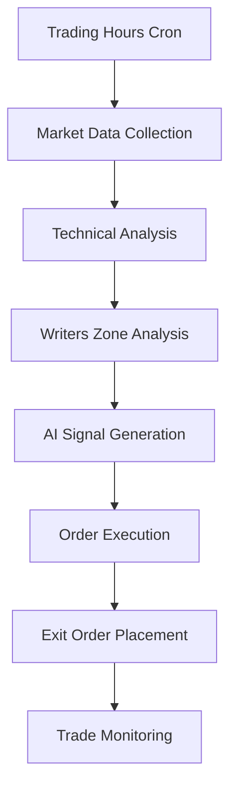
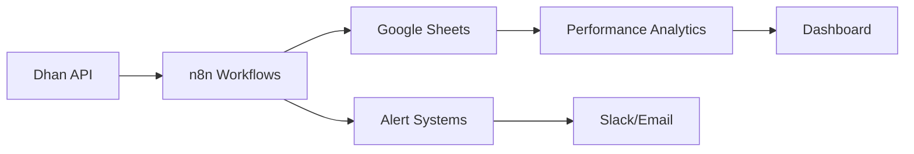

# 🏗️ Complete System Architecture: Dhan Trading Bot Ecosystem

## 📋 System Overview

This document provides a comprehensive overview of the complete Dhan trading bot ecosystem, including all workflows, data flows, and system interactions.

## 🎯 Architecture Components

### 1. Core Trading System



#### Primary Trading Workflow
- **Entry Point**: Cron-triggered execution every 5 minutes during market hours
- **Data Collection**: Real-time market data from Dhan API
- **Analysis Engine**: Multi-factor technical and option flow analysis
- **Decision Making**: AI-powered signal generation with confidence scoring
- **Execution**: Automated order placement with risk management
- **Monitoring**: Continuous trade tracking and management

#### Exit Order Monitor Workflow
- **Monitoring Frequency**: Every 2 minutes during market hours
- **Order Tracking**: Real-time status monitoring of SL and Target orders
- **Automatic Cancellation**: Opposite order cancellation upon execution
- **Performance Logging**: Comprehensive trade performance tracking
- **Alert System**: Multi-channel notifications for critical events

### 2. Data Flow Architecture



#### Data Sources
- **Primary**: Dhan API for all market data and order management
- **Secondary**: External sentiment APIs for market sentiment analysis
- **Tertiary**: Google Sheets for data persistence and analytics

#### Data Storage
- **Real-Time Data**: In-memory processing within n8n workflows
- **Persistent Data**: Google Sheets for historical data and analytics
- **Backup Data**: Local logs and error tracking systems

### 3. System Integration Points

#### API Integration Layer
```javascript
const apiIntegrations = {
  dhan: {
    endpoints: {
      authentication: '/login',
      marketData: '/v2/marketfeed/ltp',
      ohlcData: '/v2/charts/intraday',
      orderManagement: '/v2/orders',
      instrumentMaster: '/api-data/api-scrip-master.csv'
    },
    rateLimit: '100 requests/minute',
    reliability: '99.5% uptime'
  },
  
  googleSheets: {
    sheets: [
      'Dhan_Signals',
      'Dhan_Active_Trades', 
      'Dhan_Trade_Summary',
      'Dhan_Performance_Log',
      'Dhan_Alert_Log'
    ],
    updateFrequency: 'Real-time',
    backup: 'Daily automated backup'
  },
  
  alertSystems: {
    slack: 'Real-time notifications',
    email: 'Critical alerts only',
    sheets: 'All events logged'
  }
};
```

#### Workflow Orchestration
```javascript
const workflowOrchestration = {
  mainTradingBot: {
    schedule: '*/5 9-15 * * 1-5',
    dependencies: ['market-hours', 'api-availability'],
    failureHandling: 'retry-with-backoff',
    timeout: '300 seconds'
  },
  
  exitOrderMonitor: {
    schedule: '*/2 9-15 * * 1-5',
    dependencies: ['active-trades-exist'],
    failureHandling: 'continue-monitoring',
    timeout: '120 seconds'
  },
  
  performanceAnalytics: {
    schedule: '0 16 * * 1-5',
    dependencies: ['market-close'],
    failureHandling: 'retry-next-day',
    timeout: '600 seconds'
  }
};
```

### 4. Security Architecture

#### Authentication & Authorization
```javascript
const securityModel = {
  apiCredentials: {
    storage: 'environment-variables',
    encryption: 'AES-256',
    rotation: 'monthly',
    access: 'workflow-specific'
  },
  
  dataAccess: {
    googleSheets: 'service-account-based',
    apiEndpoints: 'token-based-auth',
    logging: 'comprehensive-audit-trail'
  },
  
  networkSecurity: {
    connections: 'HTTPS-only',
    apiKeys: 'encrypted-at-rest',
    transmission: 'TLS-1.3',
    monitoring: 'real-time-threat-detection'
  }
};
```

#### Risk Controls
```javascript
const riskControls = {
  positionLimits: {
    maxPositions: 5,
    maxRiskPerTrade: '2%',
    maxDailyLoss: '10%',
    maxDrawdown: '15%'
  },
  
  operationalLimits: {
    apiCallLimits: 'rate-limited',
    orderFrequency: 'throttled',
    systemResources: 'monitored',
    errorThresholds: 'alerting-enabled'
  },
  
  emergencyControls: {
    killSwitch: 'manual-override',
    positionFlattening: 'automated',
    systemShutdown: 'error-threshold-based',
    manualIntervention: 'alert-triggered'
  }
};
```

### 5. Performance Monitoring

#### System Health Metrics
```javascript
const healthMetrics = {
  apiPerformance: {
    responseTime: 'average < 500ms',
    successRate: '> 99%',
    errorRate: '< 1%',
    availability: '> 99.5%'
  },
  
  tradingPerformance: {
    executionSpeed: '< 2 seconds',
    slippage: '< 0.1%',
    fillRate: '> 98%',
    accuracy: '> 95%'
  },
  
  systemResources: {
    cpuUsage: '< 70%',
    memoryUsage: '< 80%',
    diskSpace: '> 20% free',
    networkLatency: '< 100ms'
  }
};
```

#### Performance Analytics Dashboard
```javascript
const dashboardMetrics = {
  realTimeMetrics: {
    activeTrades: 'current-position-count',
    todaysPnL: 'session-profit-loss',
    winRate: 'success-percentage',
    systemStatus: 'health-indicator'
  },
  
  historicalMetrics: {
    weeklyPerformance: '7-day-rolling',
    monthlyPerformance: '30-day-rolling',
    yearlyPerformance: 'annual-summary',
    benchmarkComparison: 'index-relative'
  },
  
  riskMetrics: {
    currentDrawdown: 'peak-to-trough',
    volatilityOfReturns: 'standard-deviation',
    sharpeRatio: 'risk-adjusted-return',
    maxDrawdown: 'historical-maximum'
  }
};
```

### 6. Scalability Design

#### Horizontal Scaling
```javascript
const scalabilityFeatures = {
  multipleStrategies: {
    support: 'parallel-execution',
    isolation: 'strategy-specific-workflows',
    resourceSharing: 'optimized-api-usage',
    coordination: 'centralized-risk-management'
  },
  
  multipleInstruments: {
    support: 'nifty-banknifty-others',
    dataManagement: 'instrument-specific-sheets',
    riskManagement: 'portfolio-level-controls',
    monitoring: 'unified-dashboard'
  },
  
  cloudDeployment: {
    containerization: 'docker-support',
    orchestration: 'kubernetes-ready',
    autoScaling: 'load-based-scaling',
    monitoring: 'cloud-native-metrics'
  }
};
```

#### Performance Optimization
```javascript
const optimizationStrategies = {
  dataProcessing: {
    caching: 'instrument-master-cache',
    batching: 'multiple-api-calls',
    compression: 'data-transfer-optimization',
    parallelization: 'concurrent-processing'
  },
  
  memoryManagement: {
    garbageCollection: 'periodic-cleanup',
    dataStructures: 'efficient-algorithms',
    caching: 'intelligent-cache-eviction',
    monitoring: 'memory-leak-detection'
  },
  
  networkOptimization: {
    connectionPooling: 'reuse-connections',
    requestBatching: 'minimize-round-trips',
    compression: 'gzip-encoding',
    cdn: 'static-asset-delivery'
  }
};
```

### 7. Disaster Recovery

#### Backup and Recovery
```javascript
const disasterRecovery = {
  dataBackup: {
    frequency: 'real-time-replication',
    retention: '1-year-historical',
    verification: 'automated-integrity-checks',
    restoration: 'point-in-time-recovery'
  },
  
  systemRecovery: {
    failover: 'automatic-failover',
    redundancy: 'multi-region-deployment',
    monitoring: 'health-check-based',
    alerting: 'immediate-notification'
  },
  
  businessContinuity: {
    manualOverride: 'emergency-procedures',
    alternativeExecution: 'manual-trading-protocols',
    communicationPlan: 'stakeholder-notification',
    recoveryTesting: 'quarterly-drills'
  }
};
```

#### Emergency Procedures
```javascript
const emergencyProcedures = {
  systemFailure: {
    immediate: [
      'stop-all-workflows',
      'assess-open-positions',
      'notify-stakeholders',
      'activate-manual-mode'
    ],
    recovery: [
      'identify-root-cause',
      'implement-fix',
      'test-functionality',
      'gradual-restart'
    ]
  },
  
  marketCrisis: {
    immediate: [
      'activate-emergency-stop',
      'flatten-all-positions',
      'assess-market-conditions',
      'implement-risk-controls'
    ],
    recovery: [
      'wait-for-stability',
      'validate-systems',
      'test-with-small-positions',
      'resume-normal-operations'
    ]
  }
};
```

### 8. Compliance and Auditing

#### Audit Trail
```javascript
const auditingFramework = {
  transactionLogging: {
    scope: 'all-trading-activities',
    detail: 'complete-order-lifecycle',
    retention: 'regulatory-compliance',
    access: 'controlled-and-logged'
  },
  
  systemLogging: {
    scope: 'all-system-activities',
    detail: 'error-and-performance-logs',
    retention: '90-days-minimum',
    monitoring: 'real-time-analysis'
  },
  
  complianceReporting: {
    frequency: 'daily-summary',
    content: 'regulatory-requirements',
    distribution: 'authorized-personnel',
    archival: 'long-term-storage'
  }
};
```

#### Regulatory Compliance
```javascript
const complianceFeatures = {
  riskManagement: {
    positionLimits: 'regulatory-compliant',
    riskControls: 'automated-enforcement',
    reporting: 'real-time-monitoring',
    documentation: 'comprehensive-records'
  },
  
  dataProtection: {
    encryption: 'industry-standard',
    access: 'role-based-controls',
    retention: 'policy-compliant',
    disposal: 'secure-deletion'
  },
  
  operationalRisk: {
    monitoring: 'continuous-assessment',
    controls: 'automated-enforcement',
    reporting: 'exception-based',
    testing: 'regular-validation'
  }
};
```

## 🔄 System Interactions

### 1. Workflow Dependencies
```javascript
const workflowDependencies = {
  mainTradingBot: {
    triggers: ['market-hours', 'system-health'],
    dependencies: ['dhan-api', 'google-sheets'],
    outputs: ['trade-signals', 'order-placements'],
    consumers: ['exit-monitor', 'performance-tracker']
  },
  
  exitOrderMonitor: {
    triggers: ['active-trades-exist', 'market-hours'],
    dependencies: ['dhan-api', 'google-sheets', 'main-trading-bot'],
    outputs: ['exit-executions', 'performance-data'],
    consumers: ['alert-system', 'analytics-engine']
  }
};
```

### 2. Data Synchronization
```javascript
const dataSynchronization = {
  realTimeSync: {
    frequency: 'immediate',
    scope: 'critical-trading-data',
    method: 'event-driven',
    reliability: 'guaranteed-delivery'
  },
  
  batchSync: {
    frequency: 'end-of-day',
    scope: 'analytical-data',
    method: 'scheduled-batch',
    reliability: 'retry-on-failure'
  },
  
  backupSync: {
    frequency: 'continuous',
    scope: 'all-system-data',
    method: 'incremental-backup',
    reliability: 'redundant-storage'
  }
};
```

## 🎯 Future Architecture Enhancements

### 1. Microservices Architecture
- **Service Decomposition**: Break down monolithic workflows into microservices
- **API Gateway**: Centralized API management and routing
- **Service Mesh**: Inter-service communication and monitoring
- **Container Orchestration**: Kubernetes-based deployment and scaling

### 2. Event-Driven Architecture
- **Event Streaming**: Real-time event processing with Apache Kafka
- **Event Sourcing**: Complete audit trail through event logs
- **CQRS**: Command Query Responsibility Segregation for better performance
- **Reactive Systems**: Responsive, resilient, and elastic system design

### 3. Machine Learning Integration
- **Predictive Analytics**: ML-powered market prediction models
- **Adaptive Strategies**: Self-learning trading algorithms
- **Risk Prediction**: AI-based risk assessment and management
- **Performance Optimization**: Continuous strategy improvement through ML

This comprehensive system architecture provides a robust, scalable, and maintainable foundation for professional algorithmic trading operations with the Dhan API ecosystem.