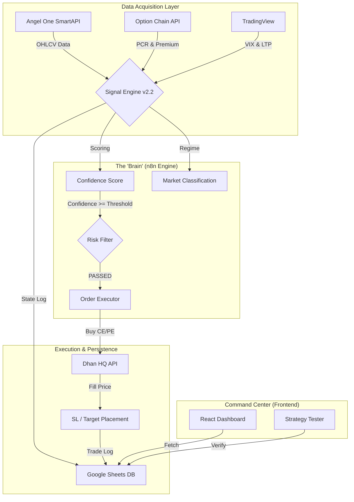

# 🚀 PROXIMUS-1: NIFTY ALPHA Trading System
## Operational Architecture & Strategic Technical Guide

> **Project Identity:** A high-fidelity, automated intraday options trading framework.
> **Current Version:** v2.3.0 (Operational Baseline)
> **Core Objective:** To eliminate emotional bias and execution latency in NIFTY 50 options trading through a data-driven, multi-indicator consensus engine.

---

## 1. Executive Summary

Proximus-1 is a sophisticated trading ecosystem that bridges the gap between retail technical analysis and institutional-grade execution. By leveraging a distributed architecture (n8n for logic, Dhan for execution, and React for visualization), the system monitors the NIFTY 50 index in 5-minute intervals, calculating a composite "Confidence Score" derived from 17 technical indicators and live market sentiment.

### Key Performance Pillars:
- **Agility:** Sub-200ms signal-to-order execution latency.
- **Precision:** Multi-regime classification (8 distinct market states) ensuring the bot only trades in high-probability conditions.
- **Transparency:** Every logic branch taken by the engine is logged exactly, allowing for "white-box" auditing of every trade.
- **Verification:** Integrated Strategy Tester that cross-references simulated signals with real historical trade P&L.

---

## 2. System Architecture (The "Nervous System")

The system operates across three primary layers, ensuring decoupling of concerns and high fault tolerance.

---

## 3. The Signal Engine v2.2: Deep Dive

At the heart of Proximus-1 is a custom-coded JavaScript engine (`signal Code1`) that processes raw market data into executable signals.

### A. The Scoring Matrix
Unlike simple "crossover" bots, Proximus-1 uses a **weighted consensus model**. Every indicator contributes a specific point value to the global score (-100 to +100).

| Group | Indicators | Strategic Weight |
|---|---|---|
| **Trend** | SuperTrend, EMA20, SMA50 | **High (±40 total)** - Provides the primary directional bias. |
| **Momentum** | MACD Flip, RSI, PSAR | **Critical (±35 total)** - Detects early reversals and "burst" entries. |
| **Liquidity/Vol** | Volume Ratio, India VIX | **Guard (Blocking)** - Acts as a circuit breaker for low-liquidity or high-panic zones. |
| **Sentiment** | PCR, Writers Zone | **Confirmation (±10)** - Aligns execution with institutional "smart money" positioning. |

### B. Adaptive Risk Gates
The engine doesn't just look at indicators; it filters them through environmental logic:
1. **The VIX Gate:** If India VIX > 18 (High Panic), the system sets signal to **AVOID**, protecting capital from erratic slippage.
2. **The ADX Penalty Ladder:**
   - **ADX > 25:** Strong Trend (Boosts score by +8).
   - **ADX < 10:** Weak Trend (Halves the total score to prevent "chopped" sideways losses).
3. **Repeat Protection:** Ensures the bot doesn't "double-tap" the same direction within a short window, preventing over-exposure.

---

## 4. Operational Workflow (The Lifecycle of a Trade)

Each 5-minute candle trigger initiates a rigorously defined sequence:

1. **Ingestion:** n8n fetches 1-min and 5-min bars from Angel One.
2. **Analysis:** The `Calculate All Technical Indicators1` node refreshes 20+ math models.
3. **Decisioning:** Signal Engine v2.2 evaluates indicators. If a signal meets the confidence threshold (e.g., +25 for Call, -25 for Put) **and** confirms a 2-bar streak, it proceeds.
4. **Symbology Sync:** The `Prepare Dhan Order1` node pulls the **Live Option Chain**. It dynamically identifies the **At-The-Money (ATM)** strike and its unique **Security ID**.
5. **Execution:**
   - **Step A:** Market Order placed on Dhan for the selected Option.
   - **Step B:** On success, the bot immediately calculates a **Dynamic Stop Loss (12 pts)** and **Target (25 pts)** based on the actual fill price.
   - **Step C:** Parallel placement of SL and Target orders to ensure the position is protected within milliseconds.
6. **Logging:** Every detail—the logic trace, the order IDs, and the market regime—is written to Google Sheets.

---

## 5. The Command Center (Monitoring & Analysis)

The React dashboard provides real-time visibility into the "Brain" and the "Wallet".

### Key Modules:
- **Intelligent KPI Grid:** Tracks Win Rate, Profit Factor, and Sharpe Efficiency Index in real-time.
- **Logic Trace Feed:** Displays why the engine decided to BUY or WAIT in plain English (e.g., *"MACD Bullish Flip | RSI Oversold | ADX Trending"*).
- **Strategy Tester:** A sandbox environment where users can replay historical data. It unique feature is **"Real Match Verification"**, where every simulated trade is checked against actual Google Sheet records to confirm if the bot's prediction held true in the live market.

---

## 6. How to Explain This Project (The Elevator Pitch)

If you are explaining Proximus-1 to a stakeholder or developer, use this professional framing:

> "We have built an **Automated Option Execution Ecosystem** for NIFTY. It isn't just a strategy; it's a full-stack pipeline.
> 
> 1. **Data:** We ingest live feeds from high-speed APIs.
> 2. **Logic:** Our custom Signal Engine (v2.2) uses a weighted consensus of 17 indicators, adjusting its aggression based on the 'Market Regime' (like Volatility or Trend Strength).
> 3. **Execution:** It handles the entire lifecycle—from picking the right option strike to placing automated protection (SL/Target) via Dhan HQ.
> 4. **Analysis:** We have a dedicated React dashboard that gives us institutional-grade analytics and a backtester that verifies our rules against real-world trade data.
>
> It’s a 'White-Box' system: we know exactly WHY every trade happened, and we can tune the logic without touching the infrastructure."

---

## 7. Security & Reliability Measures

- **Daily Token Handshake:** Automated daily login to Angel One/Dhan for fresh API authorization.
- **Dynamic Security IDs:** No hardcoded symbols; the bot "reads" the exchange every 5 minutes to ensure it's trading the correct, unexpired contract.
- **Error Propagation:** If market data is missing (`LTP = 0`), the system defaults to a safe **DATA_FAILURE** state rather than making blind trades.

---

## 8. Development Roadmap

- [x] **Phase 1:** Core Logic & Integration (n8n + Dhan).
- [x] **Phase 2:** Signal Engine v2.2 Refinement (Confidence & Regimes).
- [x] **Phase 3:** Visual Dashboard & Strategy Tester.
- [ ] **Phase 4:** Multi-Lot scaling and ML-based Sentiment Analysis.
- [ ] **Phase 5:** Supabase integration for milliseconds-latency data persistence.

---
*Documented by Antigravity AI for the NIFTY ALPHA Project Team.*
