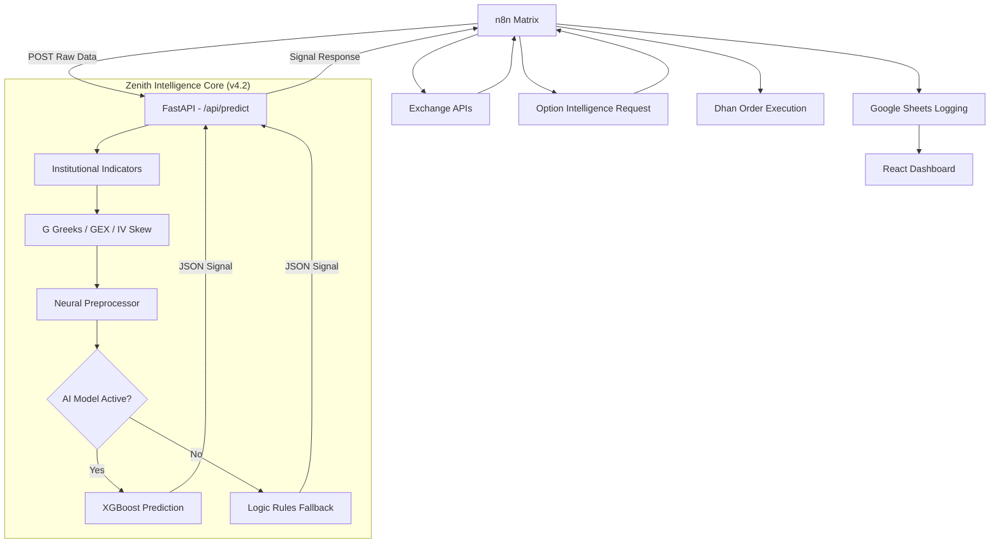

# 📊 ZENITH: Complete System Technical Documentation

> **Version:** 4.2.0 (Institutional Deployment)
> **Last Updated:** 11 March 2026
> **Aesthetic:** ZENITH Professional Midnight
> **Core Guide:** [ZENITH_SYSTEM_HANDBOOK.md](./ZENITH_SYSTEM_HANDBOOK.md)

---

## Table of Contents

1. [System Overview](#1-system-overview)
2. [Architecture (Zenith Standard)](#2-architecture-zenith-standard)
3. [Operational Workflow](#3-operational-workflow)
4. [Intelligence Hub (Python API)](#4-intelligence-hub-python-api)
5. [Terminal Interface (React)](#5-terminal-interface-react)
6. [Data Schema & Persistence](#6-data-schema--persistence)

---

## 1. System Overview

### Institutional Technology Stack

| Layer | Technology | Purpose |
|---|---|---|
| **Market Intelligence** | Python 3.12, XGBoost | Probabilistic trend analysis & vector engineering |
| **Logic Orchestrator** | n8n | Operational pipeline management & state persistence |
| **Execution Gateway** | Dhan HQ API | Strategic market engagement & order management |
| **Market Data Feed** | Angel One SmartAPI | Real-time tick & greeks ingestion |
| **Persistent Ledger** | Google Sheets v4.2 | High-fidelity trade & signal auditing |
| **Terminal Interface** | React 18, Vite, TS | Professional monitoring & system control hub |

---

## 2. Architecture (Zenith Standard)
The system operates on an **Integrated Intelligence** paradigm, ensuring clear separation between analysis (Python), orchestration (n8n), and visualization (Terminal).

1.  **Intelligence Hub (Python):** Handles high-density feature engineering and signal generation.
2.  **Operational Matrix (n8n):** Serves as the nervous system, connecting market data to execution.
3.  **Terminal Interface (React):** Provides real-time visibility and terminal-wide controls.



---
│                                         ↓                       ↓    │
│                               ┌──────────────┐      ┌────────────┐  │
│                               │ Place Stop   │      │ Place      │  │
│                               │ Loss Order   │      │ Target     │  │
│                               └──────────────┘      └────────────┘  │
│                                         │                       │    │
│                                         └───────────┬───────────┘    │
│                                                     ↓                │
│                                         ┌─────────────────────┐     │
│                                         │ Log Active Trade     │     │
│                                         │ Log Trade Summary    │     │
│                                         │ → Google Sheets      │     │
│                                         └─────────────────────┘     │
└─────────────────────────────────────────────────────────────────────┘
                                      │
                          ┌───────────┴──────────┐
                          ↓                      ↓
               ┌─────────────────┐    ┌──────────────────────┐
               │  Google Sheets  │    │  React Dashboard      │
               │  (3 sheets)     │←──→│  (localhost:5173)     │
               └─────────────────┘    └──────────────────────┘
```

---

## 3. Directory Structure (v4.0 AI)

```
project/
│
├── api/                          # 🧠 THE BRAIN: Python AI Engine
│   ├── engine/                   # Core Logic (Indicators, Greeks, AI)
│   ├── main.py                   # FastAPI Gateway
│   └── start_server.bat          # VirtualEnv & Server Launcher
│
├── src/                          # 🖥️ THE VIEW: React Frontend Source
│   ├── services/                 # Sheets API & Data Fetchers
│   └── index.css                 # 🎨 Professional Dark Design System
│
├── n8n/                          # 🎡 THE MESSENGER: n8n Automation
│   └── workflows/                # v4.0 AI Workflow exports
│
├── docs/                         # 📚 THE KNOWLEDGE: Guides & PRDs
│   ├── guides/                   # Operational and Setup guides
│   └── NIFTY_ALPHA_PROJECT_BOOK.md # Unified project handbook
│
└── archive/                      # Legacy code and v3.0 engines
```

---

## 4. Data Flow — End to End (v4.0 AI)

### Step 1 — Raw Data Fetch (every 5 min)
n8n gathering inputs:
- **Angel One:** 1-min & 5-min OHLCV.
- **NSE/Dhan:** Option Chain Data.

### Step 2 — The Brain Call (FastAPI)
n8n sends raw data to **localhost:8000/api/predict**.

### Step 3 — Python Logic Execution
Python calculates **57 features** (RSI, GEX, IV Skew, etc.) and runs the **XGBoost AI Ensemble**. It falls back to **Rules Engine** if no model is found.

### Step 4 — Decision return
Python returns a JSON signal with `finalSignal`, `confidence`, and `aiInsights`.

### Step 5 — Institutional Logging
n8n logs the 57-feature decision package to the Google Sheet dataset.

### Step 6 — Order Execution
If BUY signal, n8n places a Bracket Order on Dhan API.

### Step 7 — Order Preparation
```
Signal → Prepare Dhan Order1
       → Selects correct option strike from chain
       → Calculates quantity (lotSize × lots)
       → CRITICAL: Syncs live LTP AND Security ID from Option Chain Request1
       → Outputs: tradingSymbol, securityId, orderType, price, quantity, ltp
```

### Step 8 — Order Placement
```
Prepared order → Place Entry Order (Dhan HTTP Node)
               → Returns: orderId, status, fillPrice, executedQty
```

### Step 9 — SL & Target Calculation
```
Entry fill → Calculate SL & Target
           → SL = entryPrice - 12 points
           → Target = entryPrice + 25 points
           → Outputs: stopLossOrder, targetOrder (with dynamic securityId)
```

### Step 10 — SL & Target Placement (parallel)
```
SL Order → Place Stop Loss (Dhan)
Target   → Place Target Order (Dhan)
```

### Step 11 — Logging
```
All order IDs + prices → Log Active Trade → Dhan_Active_Trades sheet
                       → Log Trade Summary → Dhan_Trade_Summary sheet
```

---

## 5. n8n Workflow

### Key Workflow Files

| File | Description |
|---|---|
| `n8n/workflows/NEWN8NFINAL.JSON` | **Use this** — latest workflow with all fixes applied |
| `n8n/workflows/n8n_workflow.json` | Older version (may have bugs) |
| `docs/guides/WORKFLOW_FIX_GUIDE.md` | Step-by-step instructions to apply all 9+ bug fixes |

### Workflow Node Map

```
[Trading Hours Trigger]
    → [Trading Hour Filter1]
    → [Getsheet Node]                 ← NEW: Direct Google Sheet fetch (Optimized)
    → [Parse master Copy1]           ← Processes direct JSON data
    → [Angel One Login]              
    → [Option Chain Request1]        
    → [NIFTY Option Chain Builder1]  
    → [Calculate All Technical Indicators1]
    → [Writers Zone Analysis1]
    → [signal Code1]                 
    → [Log Signal to Sheets4]        
    → [Signal-Filter3 / IF Gate]    
    → [Prepare Dhan Order1]
    → [Place Entry Order]
    → [Calculate SL & Target]
    → [Place Stop Loss]  
    → [Place Target Order] 
    → [Log Active Trade]
    → [Log Trade Summary]
```

### Critical n8n Settings

- **Cron Schedule:** `*/5 9-15 * * 1-5` (every 5 min, Mon–Fri, 9:00–15:55)
- **Error handling:** Set to "Continue on error" for order nodes
- **Memory:** `global.signalMemory` persists streak and last signal between runs

---

## 6. Signal Engine v3.0

**Active File:** `n8n/scripts/signal_code_v3.0.js` — paste into n8n's `signal Code1` node
**Backups:** `n8n/scripts/signal_code_v2.2.js`, `n8n/scripts/signal_code_v2.1_backup.js`

### Decision Logic (v3.0 Execution Order)

```
1.  Daily reset check  → clear lastSignal/streak/ORB if new trading day
2.  LTP = 0 guard      → ERROR (data failure)
3.  Market hours gate  → MARKET_CLOSED if outside 09:15–15:30 IST
4.  ORB Tracking       → Track first 3 bars (09:15–09:30) high/low for ORB
5.  Opening Buffer     → No signals before 09:45 IST (avoid opening noise)
6.  VIX Graduated      → 18→×0.7, 20→×0.5, 22→×0.3, ≥25→AVOID
7.  ADX < 20 + Ranging → SIDEWAYS (same as v2.2)
8.  Score all indicators with rebalanced weights
9.  SuperTrend cross-validation (needs EMA+PSAR consensus)
10. RSI divergence detection (swing-based, 6-bar window)
11. ORB breakout/breakdown scoring
12. Bollinger Band squeeze detection
13. Trend-filtered Stochastic (ignore overbought in uptrend)
14. VWAP stuck-detection (ignore if unchanged 20+ bars)
15. OI PCR scoring (+4/-4 based on putCallOIRatio)
16. Writers Zone scoring (same as v2.2)
17. ADX bonus/penalty with min-score guard
18. Volume scoring with phantom-flip guard
19. Candle patterns (reversal vs continuation, volume-gated)
20. Trend exhaustion detection (ADX was >40 now declining)
21. Combined multiplier floor (min 0.3 — prevents signal crushing)
22. Time-of-day penalty (×0.7 after 14:30 IST)
23. Streak check (MIN_STREAK = 2 bars)
24. Repeat protection with auto-clear after 3 WAIT bars
25. Output: finalSignal + engineVersion: "v3.0"
```

### Scoring Weights (v3.0)

| Indicator | Bullish | Bearish | Notes |
|---|---|---|---|
| MACD Histogram Flip | +12 | -12 | Reduced from ±20 (was too dominant) |
| MACD Histogram Rising | +6 | -6 | Continuation |
| MACD Signal Crossover | +4 | -4 | Baseline, non-flip |
| EMA20 | +12 | -12 | **Highest accuracy (92%)** — promoted |
| PSAR | +10 | -10 | High accuracy (85%) — promoted |
| SuperTrend (validated) | +8 | -8 | Only if EMA+PSAR agree |
| SuperTrend (unvalidated) | +3 | -3 | Penalty for lack of consensus |
| SMA50 | +5 | -5 | Kept same |
| RSI Extreme | +8 | -8 | RSI < 35 or > 65 |
| RSI Neutral-Bullish/Bearish | +3 | -3 | 55–65 / 35–45 |
| RSI Divergence | +10 | -10 | NEW: swing-based divergence |
| VWAP | +6 | -6 | Reduced, stuck-detection added |
| Aroon | +8 | -8 | Good accuracy (81%) — kept |
| Stochastic (trend-filtered) | +2 to +5 | -2 to -5 | Ignore overbought in uptrend |
| BB Breakout | +6 | -6 | Added squeeze detection |
| CCI | +3 | -3 | Low correlation — reduced |
| MFI | +2 | -2 | Near-random — reduced |
| ORB Breakout | +12 | -12 | NEW: opening range breakout |
| Volume confirmation | +5 | -5 | With phantom-flip guard |
| Candle (reversal) | +5 | -5 | Applies regardless of direction |
| Candle (continuation) | +5 | -5 | Volume-gated, direction-aligned |
| Candle (Doji) | ±2 | ±2 | Reduces confidence in direction |
| OI PCR | +4 | -4 | NEW: from Writers Zone |
| Writers Zone | up to ±12 | up to ±12 | conf × WRITERS_WEIGHT |
| ADX ≥ 25 boost | +8 | -8 | Only if |score| ≥ 5 |
| Time-of-day penalty | — | — | ×0.7 after 14:30 IST |
| Trend exhaustion | — | — | ×0.7 if ADX was >40, now declining |
| Combined multiplier floor | — | — | Min 0.3 (prevents triple-compounding) |

### VIX Graduated Scaling (v3.0)

| VIX Range | Action |
|---|---|
| < 18 | No penalty (normal) |
| 18–20 | Score × 0.7 |
| 20–22 | Score × 0.5 |
| 22–25 | Score × 0.3 |
| ≥ 25 | AVOID (hard cutoff) |

### Thresholds (v3.0)

| Parameter | Value | Notes |
|---|---|---|
| BUY CE threshold | +25 | Was 0 in v2.2 (any positive fired) |
| BUY PE threshold | -25 | Was -0 in v2.2 |
| MIN_STREAK | 2 | Was 1 in v2.2 |
| ADX_BOOST_MIN_SCORE | 5 | ADX only boosts if |score| ≥ 5 |
| REPEAT_CLEAR_AFTER_WAITS | 3 | Auto-clear direction lock after 3 WAITs |
| OPENING_BUFFER_MINUTES | 30 | No signals before 09:45 IST |
| ORB_BARS | 3 | First 3 bars define opening range |

### Memory State (v3.0 — Persistent via `$getWorkflowStaticData`)

| Field | Type | Purpose |
|---|---|---|
| `lastSignal` | String | Last fired signal — drives repeat protection |
| `prevMACDHist` | Float | Previous bar's MACD histogram for flip detection |
| `streakSignal` | String | Signal direction being streaked |
| `streakCount` | Integer | Consecutive bars of same signal |
| `lastFireTime` | ISO String | Timestamp of last fired signal |
| `lastTradeDate` | String (YYYY-MM-DD) | IST date — triggers daily reset on change |
| `prevLTP` | Float | Previous bar's LTP |
| `prevRSI` | Float | Previous bar's RSI for divergence |
| `prevADX` | Float | Previous bar's ADX for exhaustion detection |
| `orbHigh/orbLow` | Float | Opening Range Breakout high/low |
| `orbBarCount/orbSet` | Int/Bool | ORB bar tracking state |
| `ltpHistory[20]` | Array | LTP history for divergence |
| `rsiHistory[20]` | Array | RSI history for divergence |
| `lastVWAP` | String | Previous VWAP status for stuck detection |
| `vwapStuckCount` | Int | Bars with unchanged VWAP status |
| `firedSignalDirection` | String | Current direction lock (CE/PE) |
| `consecutiveWaits` | Int | WAIT bars since last signal (for repeat clear) |
| `firstBarOfDay` | Bool | First scoring bar flag (MACD gap-open guard) |

### Output Fields (v3.0)

| Field | Type | Description |
|---|---|---|
| `finalSignal` | String | BUY CALL (CE) / BUY PUT (PE) / WAIT / AVOID / SIDEWAYS / MARKET_CLOSED |
| `rawSignal` | String | Pre-filter direction before repeat protection |
| `confidence` | Float | Final composite score |
| `Momentum` | Float | MACD histogram value |
| `VolumeRatio` | Float/null | latestVol/avgVol — null if data missing |
| `streakCount` | Integer | Consecutive bars of same raw signal |
| `streakConfirmed` | Boolean | Whether streak >= MIN_STREAK |
| `reason` | String | Pipe-separated logic trace |
| `blockedReason` | String | Why finalSignal stayed WAIT |
| `regime` | String | Market regime classification |
| `ADX` | Float | ADX value at signal time |
| `MACDFlip` | String | BULLISH_FLIP / BEARISH_FLIP / NONE |
| `SuperTrend` | String | Bullish / Bearish / Neutral |
| `SuperTrendValidated` | Bool | Whether ST was cross-validated |
| `orbRange` | Object | {high, low} or null |
| `vixMultiplier` | Float | VIX scaling factor applied |
| `combinedMultiplier` | Float | Total penalty multiplier |
| `debugFlags` | Array | Active flags (ORB, BB_SQUEEZE, etc.) |
| `sessionDate` | String | IST date used for daily reset |
| `engineVersion` | String | Always `"v3.0"` |

### Regime Classification (unchanged from v2.2)

| Regime | Condition |
|---|---|
| `HIGH_VOLATILITY` | VIX ≥ 25 (was 18 in v2.2) |
| `SIDEWAYS_RANGING` | ADX < 20 AND PriceAction = Ranging |
| `SIDEWAYS_WEAK_TREND` | ADX < 20 (not Ranging) |
| `STRONG_BULLISH` | SuperTrend Bullish AND EMA20 Bullish |
| `STRONG_BEARISH` | SuperTrend Bearish AND EMA20 Bearish |
| `BULLISH_TREND` | EMA20 Bullish |
| `BEARISH_TREND` | EMA20 Bearish |
| `MIXED` | All other combinations |
| `OFF_MARKET` | Outside 09:15–15:30 IST |
| `DATA_FAILURE` | LTP = 0 or node missing |

---

## 7. Calculate Technical Indicators v2.0

**Active File:** `n8n/scripts/calculate_technical_indicators_v2.js` — paste into n8n's `Calculate All Technical Indicators1` node

### Critical Bugs Fixed (from v1.0)

| Bug | Root Cause | Impact | Fix |
|---|---|---|---|
| **IND-1** SuperTrend stuck on "Bullish" | `calculateATR()` returned `{value: "45.23"}` (object). `multiplier * atr` = NaN | SuperTrend NEVER changed direction for 4+ days | Rolling ATR per bar using Wilder's smoothing |
| **IND-2** MACD histogram always ≈ 0 | Signal line = EMA of `[macd, macd, macd, ...]` = macd itself | MACD flip detection only worked by accident | Full MACD series → 9-period EMA signal line |
| **IND-3** VWAP always "Below" | Used 3-day cumulative data; VWAP should reset daily | VWAP bias toward "Below" in downtrends | Filters to today's candles only |
| **IND-4** RSI too sticky | Simple average instead of Wilder's exponential smoothing | RSI stayed OB/OS too long | Wilder's smoothed RSI |
| **IND-5** MFI used stale data | Always used bars 1–14 (Monday AM) instead of most recent | MFI reflected old session data | Uses last N bars |
| **IND-6** ADX not smoothed | Returned single DX value, not smoothed ADX | ADX was more volatile than expected | Proper Wilder's smoothed ADX |
| **IND-7** Cross-day candle patterns | Patterns could span session boundary | False patterns at market open | Uses today's candles when available |
| **IND-8** No empty data guard | No check for empty candle array | Crash on API failure | Returns full default object |

### New Output Fields (v2.0)

| Field | Description |
|---|---|
| `indicatorVersion` | `"v2.0"` |
| `candleCount` | Total candles received |
| `todayCandleCount` | Today's candles only |
| `BollingerBands.middle` | SMA middle band (new) |
| `SuperTrend.value` | SuperTrend line value (new) |
| `ADX.plusDI` / `ADX.minusDI` | Directional indicators (new) |

---

## 8. Writers Zone Analysis v2.0

**Active File:** `n8n/scripts/writers_zone_analysis_v2.js` — paste into n8n's `Writers Zone Analysis1` node

### Bugs Fixed

| Bug | Root Cause | Impact | Fix |
|---|---|---|---|
| **WZ-1** PCR interpretation inverted | High PCR treated as BEARISH | Direction could be wrong | Cross-references with OI: High PCR + High OI = PUT writing = BULLISH |
| **WZ-2** ATM skew simplistic | Raw premium comparison only | Could misinterpret skew | Now uses IV differential for demand-driven confirmation |
| **WZ-3** Silent failure on bad data | No guard for missing data | NEUTRAL with 0 confidence silently | Returns full default object with error reasoning |
| **WZ-4** No Max Pain calculation | OI data available but unused | Missing valuable gravitational signal | Full max pain calculation added |

### New Features (v2.0)

| Feature | Description |
|---|---|
| **Max Pain** | Calculates the strike where total option writer loss is minimized. NIFTY gravitates toward max pain near expiry. |
| **OI Change Tracking** | Detects PUT/CALL OI build-up vs decline for support/resistance strengthening |
| **Max OI Strikes** | Tracks highest OI CE strike (resistance) and highest OI PE strike (support) |
| **Smart Market Structure** | Labels like `PUT_WRITING_SUPPORT`, `CALL_WRITING_RESISTANCE`, `PUT_BUYING_FEAR`, `CALL_BUYING_BULLISH` |

### New Output Fields (v2.0)

| Field | Description |
|---|---|
| `analysisVersion` | `"v2.0"` |
| `maxPain` | Max pain strike price |
| `maxCEOIStrike` | Strike with highest CE OI |
| `maxPEOIStrike` | Strike with highest PE OI |
| `totalCEOIChange` | Net CE OI change from previous day |
| `totalPEOIChange` | Net PE OI change from previous day |

---

## 7. Order Execution Engine

### Entry Order
- **Order Type:** MARKET (or LIMIT at ATM)
- **Product:** INTRADAY (CNC is NOT used)
- **Exchange:** NSE_FNO
- **Quantity:** `lotSize × numberOfLots` (default: 75 × 1)

### Stop Loss Order
- **Type:** SL-M (Stop Loss Market)
- **Price:** `entryFillPrice - SL_POINTS` (default: 12 points)
- **securityId:** Dynamically fetched from entry order response (Bug #5 fix)

### Target Order
- **Type:** LIMIT
- **Price:** `entryFillPrice + TARGET_POINTS` (default: 25 points)
- **securityId:** Dynamically fetched from entry order response (Bug #5 fix)

### Risk/Reward
- Default R:R = 25/12 = **1:2.08**
- Max Loss per trade = 12 × 75 = **₹900**
- Max Profit per trade = 25 × 75 = **₹1,875**

---

## 8. Google Sheets Schema

**Sheet ID:** `1aTMH5Yz28X_NA6lZgtjQzc7jlu9hiAPVVuf1ASTBQoU`
**Access:** Must be set to "Anyone with the link can view"

### Sheet 1: Dhan_Signals (gid=0)

Logs every signal generated (including WAIT/AVOID).

| Column | Type | Description |
|---|---|---|
| Timestamp | DateTime | IST datetime of signal |
| Signal | String | BUY CALL (CE) / BUY PUT (PE) / WAIT / AVOID / SIDEWAYS |
| Confidence | Float | Score from signal engine (-100 to +100) |
| RSI | Float | RSI value at signal time |
| MACD | Float | MACD histogram value |
| Momentum | Float | Price momentum |
| Volume Ratio | Float | Current vol / average vol |
| VIX | Float | India VIX at signal time |
| Sentiment | String | Bullish / Bearish / Neutral |
| Writers Zone | String | BULLISH / NEUTRAL / BEARISH |
| Candle Pattern | String | Pattern name or blank |
| Spot Price | Float | NIFTY spot price |
| Market Structure | String | Market condition (Consolidation/Trending) |
| Put Call Ratio / PCR | Float | PCR from option chain |
| Writers Confidence | Float | Writers zone confidence (0–1) |
| ATM Strike | Integer | At-the-money strike price |
| *(v2 after fix)* | | |
| ADX | Float | ADX value (added after workflow fix) |
| Regime | String | Market regime classification |
| Raw Signal | String | Pre-filter signal |
| Streak Count | Integer | Consecutive bar count |
| MACD Flip | String | BULLISH_FLIP / BEARISH_FLIP / NONE |
| Blocked Reason | String | Why signal was NOT fired |
| SuperTrend | String | Bullish / Bearish |
| Reason | String | Detailed logic trace (e.g. RSI Bullish \| EMA20 Bullish) |

### Sheet 2: Dhan_Active_Trades (gid=773018112)

Tracks currently open positions.

| Column | Type | Description |
|---|---|---|
| Entry Order ID | String | Dhan order ID for entry |
| SL Order ID | String | Dhan order ID for stop-loss |
| Target Order ID | String | Dhan order ID for target |
| Trading Symbol | String | Option symbol (e.g., NIFTY25FEB22500CE) |
| Security ID | String | Dhan security ID |
| Entry Price | Float | Executed entry price |
| Stop Loss | Float | SL price |
| Target | Float | Target price |
| Quantity | Integer | Number of contracts |
| Risk Reward Ratio | Float | Max profit / max loss |
| Max Loss | Float | Maximum loss in ₹ |
| Max Profit | Float | Maximum profit in ₹ |
| Status | String | ACTIVE / OPEN / CLOSED |
| Timestamp | DateTime | Order placement time |
| Exit Type | String | TARGET / STOPLOSS / MANUAL |
| Exit Price | Float | Execution price on exit |
| PnL | Float | Realized profit/loss in ₹ |
| Actual Risk Reward | Float | Actual R:R after exit |
| Exit Timestamp | DateTime | Exit time |
| Execution Time | String | Time taken to execute |

### Sheet 3: Dhan_Trade_Summary (gid=2086062684)

Permanent record of all completed trades.

| Column | Type | Description |
|---|---|---|
| Entry Order ID | String | Dhan entry order ID |
| Timestamp | DateTime | Trade entry time |
| Signal | String | CE or PE |
| Confidence | Float | Signal confidence score |
| Trading Symbol | String | Full option symbol |
| Entry Price | Float | Entry fill price |
| Stop Loss | Float | SL price |
| Target | Float | Target price |
| Quantity | Integer | Lot size |
| Risk Reward Ratio | Float | Planned R:R |
| Max Loss | Float | Max loss in ₹ |
| Max Profit | Float | Max profit in ₹ |
| Writers Zone | String | BULLISH / NEUTRAL / BEARISH at entry |
| Market Strength | String | Market condition |
| VIX | Float | VIX at entry |
| Status | String | CLOSED / TARGET_HIT / SL_HIT |
| Exit Price | Float | Actual exit price |
| PnL | Float | Final P&L in ₹ |
| Exit Type | String | TARGET / STOPLOSS / MANUAL |
| Actual Risk Reward | Float | Actual R:R |
| Exit Timestamp | DateTime | Exit time |

---

## 9. React Frontend

### Technology Stack
- **React 18** (functional components, hooks)
- **Vite** (build tool, dev server at localhost:5173)
- **TypeScript** (strict mode enabled)
- **React Router v6** (client-side routing)
- **Recharts** (AreaChart, BarChart, PieChart)
- **Lucide React** (icons)
- **Axios** (HTTP client for Sheets + TradingView)
- **Vanilla CSS** (design system in `index.css`)

### Pages

| Route | Component | Data Source | Key Features |
|---|---|---|---|
| `/` | DashboardPage | All sheets + TradingView | 8 KPI cards, equity curve, signal feed, active positions |
| `/signals` | SignalsPage | Dhan_Signals | Expandable rows, all 16 columns, v2 columns when available |
| `/trades` | TradesPage | Dhan_Active_Trades + Summary | Active position cards, closed trades table |
| `/history` | HistoryPage | Dhan_Trade_Summary | Filter by WIN/LOSS/CE/PE/ACTIVE, search |
| `/analytics` | AnalyticsPage | Dhan_Trade_Summary | Bar chart, equity curve, exit pie, VIX buckets |
| `/backtest` | BacktestPage | Dhan_Signals + Summary | **Strategy Tester**: Real-market verified backtesting with deterministic simulation |
| `/settings` | SettingsPage | — | Config reference, risk params, quick links |

### Data Architecture

```
Google Sheets (public CSV export)
    ↕ axios GET (every 30s market hours, 3min otherwise)
sheetsApi.ts
    → fetchSignals()       → LiveSignal[]
    → fetchActiveTrades()  → ActiveTrade[]
    → fetchTradeSummary()  → TradeSummary[]
    → fetchMarketData()    → MarketSnapshot (TradingView)
    → computeTradeStats()  → TradeStats

useTrading() hook
    → Manages state, polling, error handling
    → Returns unified TradingState to all pages

App.tsx → Sidebar + Header + Router
Pages consume useTrading() directly
```

### Design System (`index.css`)

- **Background:** `#070b14` (near-black navy)
- **Cards:** `rgba(15, 23, 42, 0.8)` glassmorphism with backdrop-filter blur
- **Accent:** `#3b82f6` (blue)
- **Profit:** `#10b981` (emerald green)
- **Loss:** `#ef4444` (red)
- **Typography:** Inter (body) + JetBrains Mono (numbers, code)
- **Animations:** Shimmer skeleton loaders, fadeIn, pulse-green

---

## 10. Strategy Tester (Backtest System)

The Strategy Tester (`BacktestPage.tsx`) provides a professional environment for validating trading rules against historical signal data and real-world outcomes.

### Core Architecture

1.  **Rule-Based Simulation**: Users define parameters (SL, Target, Lot Size, Confidence Filter, Risk Mode).
2.  **Deterministic Engine**: Uses a seeded pseudo-random generator (based on signal timestamp) to ensure that the same parameters always produce the same simulation results.
3.  **Real-Market Verification**:
    *   The engine automatically attempts to match historical signals with **actual trade records** from `Dhan_Trade_Summary`.
    *   If a match is found based on time window (±5 mins) and direction (CE/PE), the tester uses the **REAL PnL and Exit Type** from the sheet.
    *   Verification icons indicate whether a result is Simulated (grey) or Verified (green checkbox).
4.  **Proprietary Metrics**:
    *   **Sharpe Efficiency Index**: A derivative metric calculating the risk-adjusted return relative to peak drawdown.
    *   **Equity Curve Modeling**: Real-time generation of cumulative PnL paths.
    *   **Win Rate vs. Profit Factor**: Correlation analysis between trade frequency and total profitability.

### Backtest Execution Flow

```javascript
Signals (gid=0) → Filter by Confidence → Simulation Loop
                                          │
    ┌─────────────────────────────────────┴─────────────────────────────────────┐
    ↓                                                                           ↓
Match found in Summary?                                         No Match Found?
(±5m, Direction)                                                (Simulation Only)
    ↓                                                                           ↓
Use REAL PnL, REAL Exit                                         Calculate Simulation PnL
Verified Status = TRUE                                          Verified Status = FALSE
    ↓                                                                           ↓
    └─────────────────────────────────────┬─────────────────────────────────────┘
                                          ↓
                            Aggregated KPIs + Equity Chart
```

---

## 11. APIs & External Services

### Angel One SmartAPI
- **Purpose:** OHLCV market data for technical indicator calculation
- **Auth:** JWT token login (`Angel One Login` node)
- **Endpoint:** `https://apiconnect.angelbroking.com`
- **Required:** API key, client ID, password, TOTP secret
- **Data fetched:** 1-min and 5-min candles for NIFTY

### Dhan HQ API
- **Purpose:** Order placement and management
- **Endpoint:** `https://api.dhan.co`
- **Auth:** Bearer token (static, set in n8n credentials)
- **Order types used:** MARKET, SL-M, LIMIT
- **Key endpoints:**
  - `POST /orders` — place order
  - `GET /orders/{id}` — check order status

### TradingView Scanner API
- **Purpose:** Live NIFTY LTP and India VIX (used in both n8n and frontend)
- **Endpoint:** `https://scanner.tradingview.com/india/scan`
- **Auth:** None (public)
- **No API key required**
- **Symbols:** `NSE:NIFTY`, `NSE:INDIAVIX`

### Google Sheets (CSV Export)
- **Purpose:** Frontend data source (read-only)
- **URL format:** `https://docs.google.com/spreadsheets/d/{SHEET_ID}/export?format=csv&gid={GID}`
- **Auth:** None (sheet must be public)
- **No API key required**
- **Limitation:** CORS-safe from browser (Google serves with CORS headers)

---

## 11. Known Bugs & Fixes Applied

### Bug #1 — Wrong node names in signal Code1
- **Problem:** Referenced `Calculate All Technical Indicators` and `Writers Zone Analysis` (missing "1" suffix)
- **Fix:** Changed to `Calculate All Technical Indicators1` and `Writers Zone Analysis1`
- **File:** `fixed_nodes/signal_code_fix.js`

### Bug #2 — Wrong node names in Prepare Dhan Order1
- **Problem:** Referenced `signal Code`, `NIFTY Option Chain Builder`, `Parse master Copy` (missing "1")
- **Fix:** Added "1" suffix to all three references
- **File:** `fixed_nodes/prepare_dhan_order_fix.js`

### Bug #3 — Wrong node name in Calculate SL & Target
- **Problem:** Referenced `Prepare NIFTY Dhan Order` (wrong name)
- **Fix:** Changed to `Prepare Dhan Order1`
- **File:** `fixed_nodes/calculate_sl_target_fix.js`

### Bug #4 — No IF gate before order placement
- **Problem:** Orders were placed for WAIT/AVOID/SIDEWAYS signals
- **Fix:** Added IF node checking `finalSignal.includes('CE') || finalSignal.includes('PE')`

### Bug #5 — Hardcoded securityId in SL and Target orders
- **Problem:** `"securityId": "39856"` hardcoded in Place Stop Loss and Place Target Order
- **Fix:** Use `{{ $('Calculate SL & Target').item.json.stopLossOrder.securityId }}`
- **File:** `fixed_nodes/calculate_sl_target_fix.js`

### Bug #6 — Empty column mappings in Log Active Trade
- **Problem:** `"value": {}` — nothing was being written to the sheet
- **Fix:** Added all column expressions mapping to correct node outputs

### Bug #7 — Empty column mappings in Log Trade Summary
- **Problem:** Same as Bug #6 for the summary sheet
- **Fix:** Added all column expressions

### Bug #8 — Hardcoded expiry date in Option Chain Request1
- **Problem:** `"Expiry": "2025-09-09"` — would fail after that date
- **Fix:** Dynamic expression calculating next Thursday

### Bug #9 — v2 signal fields not logged to Dhan_Signals sheet
- **Problem:** ADX, Regime, Raw Signal, Streak Count, MACD Flip, Blocked Reason, SuperTrend not in Log Signal node
- **Fix:** Added all fields to `Log Signal to Sheets4` node mappings

### Bug #10 — Streak counter resets every n8n execution (v2.1 Fix)
- **Problem:** Used JavaScript `global` object which resets on every workflow execution, so streak count always stayed at 1
- **Fix:** Replaced `global` with `$getWorkflowStaticData('global')` which persists between executions
- **File:** `n8n/scripts/signal_code_v2.1_backup.js`
- **Status:** ✅ Confirmed working in live session 27/02/2026

### Bug #11 — LTP Zero & Security ID Mismatch
- **Problem:** `Prepare Dhan Order1` used broken internal API calls for LTPs and static security IDs that expired when the contract rolled over (e.g., using 45556 when market shifted to 54904).
- **Fix:** Replaced internal calls and static IDs with a direct lookup from `Option Chain Request1`.
- **Root Cause Fix:** Changed `Option Chain Request1` -> `UnderlyingScrip` to `13` (NIFTY Index) to ensure full chain coverage. 
- **Result:** The bot now picks the correct live Price AND the correct exchange Security ID every run.

### Bug #12 — Writers Floor Exclusion
- **Problem:** Confidence `0.3` was excluded by a strict `> 0.3` check.
- **Fix:** Changed to `>= 0.3` and updated diagnostic messages to show actual confidence.
- **Date:** 02 March 2026

---

---

## v2.2 Blind Spot Fixes (27 February 2026)

> Applied in `n8n/scripts/signal_code_v2.2.js`. 13 issues identified via live session analysis and code audit.

### Fix #2 — Very Low ADX False Positive
- **Problem:** SIDEWAYS gate requires BOTH `ADX < 20` AND `PriceAction = Ranging`. If price action is classified as anything other than "Ranging" (e.g. "Trending"), signal bypassed the gate even at ADX < 5. Observed: ADX=4.82 fired confidence +68.
- **Fix:** Added penalty ladder entry: `if (ADX < 10) → score × 0.5` applied after all indicator scoring
- **Impact:** Halves potentially false signals on near-zero ADX markets

### Fix #4 — prevMACDHist Stale After SIDEWAYS / VIX Early Returns
- **Problem:** Both the SIDEWAYS return (line 95) and VIX AVOID return (line 86) exited before `mem.prevMACDHist = macdHist` on line 248. So after multiple SIDEWAYS bars, the first trending bar compared MACD against a very old value, producing false Bullish/Bearish Flip signals.
- **Fix:** Added `mem.prevMACDHist = macdHist` inside both the VIX block and the SIDEWAYS block, before each `return`

### Fix #5 — No Daily Reset of lastSignal
- **Problem:** `$getWorkflowStaticData` persists across days. If yesterday ended with `lastSignal = "BUY PUT (PE)"`, today's first CE signal was silently blocked by repeat protection with `blockedReason: "Repeat protection: already fired BUY PUT (PE)"`
- **Fix:** Added IST date check at startup. If `lastTradeDate !== todayIST`, clears `lastSignal`, `streakSignal`, `streakCount`, updates `lastTradeDate`. `prevMACDHist` kept (overnight gap is real data).

### Fix #6 — RSI Neutral Bands Double-Fire (RSI 45–55)
- **Problem:** `RSI Neutral-Bullish` fired for RSI 45–65, `RSI Neutral-Bearish` fired for RSI 35–55. At RSI 45–55, BOTH conditions were true simultaneously — net 0 but both cluttered the reason string.
- **Fix:** Created mutually exclusive bands with 45/55 boundary and a true dead zone: RSI 35–45 = -5, RSI 45–55 = 0 (dead zone), RSI 55–65 = +5

### Fix #7 — Volume Gap at score=0
- **Problem:** Volume logic had `score > 0` and `score < 0` branches only. score=0 received no volume penalty even with Weak Volume data.
- **Fix:** Added `else { score -= 2; reason: "Weak Volume (neutral penalty)" }` for score=0 case with Weak Volume

### Fix #8 — ADX Bonus Applied After Volume (Wrong Order)
- **Problem:** Volume confirmation checked score BEFORE the ADX boost was applied. A score that would reach +40 after ADX boost was only at +32 when volume checked it — the volume confirmation fired on a pre-ADX score.
- **Fix:** Moved the entire ADX bonus/penalty block to execute BEFORE the volume check. Volume now sees the ADX-adjusted score.

### Fix #9 — EMA+SMA Dual Bonus Triple-Counts Same Source
- **Problem:** When EMA20=Bullish AND SMA50=Bullish: engine scored +10 (EMA) + +5 (SMA) + +10 (dual bonus) = +25 total from two moving averages on the same price data. This made EMA+SMA combination (price vs. MA) the single highest-weighted input, exceeding SuperTrend (+15).
- **Fix:** Reduced dual confluence bonus from ±10 to ±5. Total when both bullish: +10 + +5 + +5 = +20

### Fix #10 — VWAP Default Causes Silent Bearish Bias
- **Problem:** `const vwapStatus = tech.VWAP?.status || "Below"` — when VWAP data was missing or null, the fallback "Below" added -8 to the score silently.
- **Fix:** Changed default to `"Neutral"` (contributes 0 when data missing)

### Fix #11 — PriceAction Default Triggers Silent SIDEWAYS Block
- **Problem:** `const priceAction = tech.PriceAction?.type || "Ranging"` — when PriceAction data was missing, defaulting to "Ranging" combined with any low ADX value would trigger the SIDEWAYS early return, killing all signals with no data-quality warning.
- **Fix:** Changed default to `"Neutral"` (does not trigger SIDEWAYS gate)

### Fix #12 — Momentum Column = Confidence (Misleading)
- **Problem:** `const momentumValue = score` — the Momentum column in Google Sheets was an exact duplicate of the Confidence column, offering no additional analytical value.
- **Fix:** Changed to `const momentumValue = macdHist` — the MACD histogram is the actual price momentum indicator

### Fix #13 — VolumeRatio Silently = 0 When Data Missing
- **Problem:** When `VolumeSpike` node returned no data, `volLatest = 0` and `volumeRatio = 0/1 = 0`. Charts showed zero volume, and there was no way to distinguish "actual zero volume" from "data unavailable".
- **Fix:** Changed to `volumeRatio = volDataMissing ? null : volLatest / volAvg`. Added `"VolumeSpike data unavailable"` to reason string when null.

### Fix #14 — SuperTrend "Neutral" Invisible in Logs
- **Problem:** SuperTrend can return "Neutral" during transitions.
- **Fix:** Added `if (superTrend === "Neutral") reasons.push("SuperTrend: Neutral (transitioning)")`.

### Optimization #1 — Direct Google Sheets Fetch (Mar 03)
- **Problem:** Downloading .xlsx from Drive (5.8s) and Extracting (3.4s) took ~9.2s total.
- **Fix:** Replaced 2 nodes with a single `Getsheet` node (Google Sheets Read).
- **Result:** Execution time for data fetch phase dropped to **2.4s**. Total workflow reliability improved.

---

## 12. Configuration Reference

### Signal Engine Thresholds (in `signal Code1` → CONFIG block)

**v3.0 LIVE CONFIG (current — 07/03/2026 onwards):**
```javascript
const CONFIG = {
    BUY_CE_MIN_CONFIDENCE: 25,   // Requires 3-4 agreeing indicators
    BUY_PE_MIN_CONFIDENCE: -25,  // Requires 3-4 agreeing indicators
    ADX_TREND_THRESHOLD:   20,   // ADX below this → SIDEWAYS gate
    ADX_VERY_LOW:          10,   // ADX below this → score halved
    ADX_BOOST_MIN_SCORE:   5,    // ADX only boosts if |score| >= 5
    RSI_OVERSOLD:          35,   // RSI below = bullish extreme
    RSI_OVERBOUGHT:        65,   // RSI above = bearish extreme
    WRITERS_WEIGHT:        12,   // Max PCR writers contribution
    REPEAT_PROTECTION:     true, // Block same-direction back-to-back fires
    REPEAT_CLEAR_AFTER_WAITS: 3, // Auto-clear direction lock after 3 WAITs
    MIN_STREAK:            2,    // 2-bar confirmation required
    PAPER_TRADING:         false,// Market hours gate ACTIVE
    OPENING_BUFFER_MINUTES: 30,  // No signals before 09:45 IST
    ORB_BARS:              3,    // First 3 bars for ORB tracking
};
```

> ✅ **v3.0 thresholds are tighter than v2.2.** Score ≥ ±25 means 3-4 indicators must agree. This filters out weak/noisy signals.

**v2.0 original backtest config (reference only):**
```javascript
const CONFIG = {
    BUY_CE_MIN_CONFIDENCE: 25,
    BUY_PE_MIN_CONFIDENCE: -25,
    MIN_STREAK:            2,
    PAPER_TRADING:         true,
};
```

### Order Parameters (in `Parse master Copy1` or `Prepare Dhan Order1`)

```javascript
const SL_POINTS = 12;         // Stop loss distance in NIFTY points
const TARGET_POINTS = 25;     // Target distance in NIFTY points
const LOT_SIZE = 75;          // NIFTY lot size
const NUMBER_OF_LOTS = 1;     // Lots to trade
const VIX_BLOCK = 18;         // VIX above this blocks all signals
```

### Frontend Configuration (in `sheetsApi.ts`)

```typescript
const SHEET_ID = '1aTMH5Yz28X_NA6lZgtjQzc7jlu9hiAPVVuf1ASTBQoU';
const GID = {
    signals: 0,
    activeTrades: 773018112,
    tradeSummary: 2086062684,
};
```

---

## 13. Deployment Guide

### n8n Setup

1. Install n8n (self-hosted or n8n.cloud)
2. Import `NEWN8NFINAL.JSON` via **Import Workflow**
3. Apply all fixes from `WORKFLOW_FIX_GUIDE.md`
4. Set up credentials:
   - Angel One API key, client ID, password, TOTP
   - Dhan API token
   - Google Sheets OAuth (for writing)
5. Set Cron to `*/5 9-15 * * 1-5`
6. Enable workflow

### Google Sheets Setup

1. Create spreadsheet (or use existing)
2. Create 3 sheets: `Dhan_Signals`, `Dhan_Active_Trades`, `Dhan_Trade_Summary`
3. Add column headers exactly as documented in §8
4. Share → **Anyone with the link can view** (for frontend access)
5. Note the Sheet ID from the URL

### React Frontend (Local)

```bash
cd project/
npm install
npm run dev          # Opens at http://localhost:5173
```

### React Frontend (Production Build)

```bash
npm run build        # Outputs to dist/
# Deploy dist/ to Vercel, Netlify, or any static host
```

---

## 14. Troubleshooting

### Frontend shows no data

1. Check Google Sheet is set to **"Anyone with link can view"**
2. Open browser DevTools → Network tab — look for failed `export?format=csv` requests
3. Verify Sheet ID in `sheetsApi.ts` matches your Google Sheet URL
4. Check GIDs: open each sheet tab and look at the URL `...#gid=XXXXXXX`

### n8n workflow not triggering signals

1. Verify all node name references use the "1" suffix (`signal Code1`, etc.)
2. Check Angel One credentials are valid (token expires daily — use TOTP)
3. Verify the Cron expression fires during IST market hours
4. Check the IF gate logic — `signal.finalSignal` must be checked correctly

### Orders placed on wrong instrument

- **Cause:** Hardcoded `securityId` (Bug #5)
- **Fix:** Apply `fixed_nodes/calculate_sl_target_fix.js`

### Orders placed for WAIT signals

- **Cause:** Missing IF gate (Bug #4)
- **Fix:** Add IF node before `Prepare Dhan Order1`, checking only CE/PE signals

### Frontend equity curve is empty

- Normal if the `Dhan_Trade_Summary` sheet has no closed trades yet
- Check `Status` column values — closed trades should NOT be `ACTIVE` or `OPEN`
- `PnL` column must be non-zero for trades to appear in the curve

### VIX showing — in frontend header

- TradingView Scanner API is rate-limited or blocked
- Will auto-recover — or check browser console for CORS errors
- The market data fetch is non-blocking; sheet data still loads

---

## 15. Live Session Reports

Session reports are stored in `docs/reports/`. Each session generates a report with signal quality analysis, issues found, and recommendations.

| Date | File | Engine | Grade | Key Finding |
| :--- | :--- | :--- | :--- | :--- |
| 27 Feb 2026 | `LIVE_SESSION_REPORT_27FEB2026.md` | v2.1 | **A-** | CE +80 peak (STRONG_BULLISH), PE -43 (crash capture). Issues: after-hours stale rows, SuperTrend lag, repeat protection gap, ADX=4.82 false positive. Led to v2.2 fixes. |

---

## 16. Future Evolution — Supabase Migration

To scale the bot from a prototype to a professional trading platform, the next step is migrating the data layer to **Supabase**.

### Why Supabase?
Supabase replaces both Google Drive (for storage) and Google Sheets (for data logging) with a high-performance PostgreSQL database.

| Advantage | Benefit to Webapp | Benefit to n8n |
| :--- | :--- | :--- |
| **Realtime** | Instant WebSocket push of new signals. | Instant confirmation of order fills. |
| **Speed** | 0.5s page loads; no CSV parsing lag. | DB writes in <50ms vs 4s for Sheets. |
| **Scale** | Can store millions of backtest signals. | Fast lookups for security IDs and scrips. |
| **Auth** | Secure login for the dashboard. | Dedicated API keys for internal microservices. |

### Migration Strategy
1.  **Phase 1**: Define PostgreSQL schema for `signals`, `active_trades`, and `summary`.
2.  **Phase 2**: Replace Google Sheet nodes in n8n with Supabase nodes.
3.  **Phase 3**: Update `sheetsApi.ts` to `supabaseClient.ts` using the Supabase JS SDK.
4.  **Phase 4**: Enable Realtime Row Level Security (RLS) for instant dashboard updates.

---

## 19. Version Changelog

### v4.0.0 — 08 March 2026
**Python AI Engine Architecture (Parallel Testing Phase)**
- **FastAPI Microservice:** Decoupled signal generation from n8n into a dedicated Python 3.12 backend.
- **AI Model Loader (`signal_engine.py`):** Ready to load XGBoost `.pkl` models to override heuristics once trained.
- **Rule Engine Fallback (`rule_engine.py`):** Faithful 1:1 port of the v3.0 JS logic, maintaining all 25 heuristic steps in Python.
- **Writers Zone v4.0 (`writers_zone.py`):** Added Gamma Exposure (GEX) regime detection (Positive/Negative), Gamma Flip level, and IV Skew Term Structure bias.
- **Indicator Calculator v4.0 (`indicators.py`):** NumPy/Pandas port of v2.0 JS logic, plus Volume Profile (POC, VAH, VAL) and Heikin Ashi trend detection.
- **Feature Engineering (`preprocessor.py`):** Normalizer mapping 60+ parameters into a flat float vector for machine learning.
- **Training Pipeline (`train_model.py`):** Cross-validated XGBoost training script with automated feature scaling and confusion matrix generation.
- **Deployment Strategy:** Local `uvicorn` setup with a cloned n8n workflow for parallel signal logging, keeping v3.0 live untouched.

### v3.0.0 — 07 March 2026
**Complete Engine Rebuild — Signal + Indicators + Writers Zone**


**Signal Engine v3.0** (`signal_code_v3.0.js` → 14 blind spots fixed):
- Graduated VIX scaling (18→×0.7, 20→×0.5, 22→×0.3, 25→AVOID)
- BUY thresholds raised from 0 to ±25 (requires 3-4 agreeing indicators)
- SuperTrend cross-validation with EMA+PSAR consensus
- Rebalanced all 13 indicator weights based on live accuracy data
- RSI swing-based divergence detection
- Opening Range Breakout (ORB) tracking
- Bollinger Band squeeze detection
- Trend-filtered Stochastic
- VWAP stuck-detection (ignore after 20 unchanged bars)
- OI PCR scoring from Writers Zone
- Time-of-day penalty (×0.7 after 14:30)
- Opening buffer (no signals before 09:45)
- Combined multiplier floor (min 0.3)
- Repeat protection with auto-clear after 3 WAIT bars
- First-bar-of-day MACD gap-open guard
- Dynamic stop-loss cascade zone detection
- Volume phantom-flip guard
- Reversal vs continuation candle pattern differentiation

**Indicator Calculator v2.0** (`calculate_technical_indicators_v2.js` → 8 bugs fixed):
- **IND-1** SuperTrend: Rolling ATR per bar (was static NaN object — root cause of stuck "Bullish")
- **IND-2** MACD: Proper signal line from MACD series (was identity — histogram always ≈0)
- **IND-3** VWAP: Daily reset, today's candles only (was 3-day cumulative — always "Below")
- **IND-4** RSI: Wilder's exponential smoothing (was simple average — too sticky)
- **IND-5** MFI: Most recent N bars (was first N bars — reflected old sessions)
- **IND-6** ADX: Wilder's smoothed ADX + DI outputs (was single unsmoothed DX)
- **IND-7** Candle patterns: Today's candles only (prevents cross-session false patterns)
- **IND-8** Error handling: Full default object on empty candle data

**Writers Zone v2.0** (`writers_zone_analysis_v2.js` → 4 bugs fixed + 3 features):
- **WZ-1** PCR interpretation corrected (high PCR + high OI = PUT writing = BULLISH)
- **WZ-2** ATM skew uses IV differential for demand-driven confirmation
- **WZ-3** Full default object returned on missing data (was silent NEUTRAL)
- **WZ-4** Max Pain calculation added
- NEW: OI change tracking (support/resistance strengthening)
- NEW: Max OI strike tracking (highest OI CE/PE)
- NEW: Smart market structure labels

### v2.3.2 — 03 March 2026
**GSheet Optimization**
- Replaced Drive Download/Extract with direct `Getsheet` node
- Execution time reduced from 9s to 2.4s

### v2.3.0 — 01 March 2026
**Strategy Tester Overhaul & UI Polish**
- Strategy Tester complete rebuild with professional layout
- Real-market verification with actual trade data
- Deterministic timestamp-seeded PRNG simulation

### v2.2 — 27 February 2026
**Signal Engine: 13 Blind Spots Fixed**
- 13 fixes applied (ADX, prevMACDHist, daily reset, RSI bands, volume, VWAP default, etc.)
- New output fields: `sessionDate`, `engineVersion`

### v2.1 — 27 February 2026
**Signal Engine: Static Data Streak Fix**
- Replaced JavaScript `global` with `$getWorkflowStaticData('global')`

### v2.0 — February 2026
**Signal Engine: Multi-Indicator Scoring**
- 14 indicators, regime classification, streak confirmation, repeat protection

### v1.0 — July–August 2025
**Initial Build**
- Basic OHLCV fetch, single-indicator logic, Dhan order placement

---

## 18. End-of-Day Session Log

### 27 February 2026 — Full Day Summary (21:21 IST Close)

#### What Was Done Today

| Time (IST) | Activity | Outcome |
| :--- | :--- | :--- |
| ~12:45 | First live market session running on v2.1 | 41 signal rows logged to Dhan_Signals sheet |
| ~15:30 | Market closed | Last PE signal at 15:30, MARKET_CLOSED rows after |
| 19:43 | Pulled all 41 rows from Google Sheet | Full phase-by-phase analysis completed |
| 19:43 | Live Session Report created | `docs/reports/LIVE_SESSION_REPORT_27FEB2026.md` |
| 20:01 | Deep code audit — 14 blind spots identified | Prioritised by severity |
| 20:06 | 13 blind spots fixed | `signal_code_v2.2.js` created |
| 20:16 | PROJECT_DOCUMENT.md fully updated | §6, §11, §12, §15, §17 all rewritten |
| 21:16 | v2.2 pasted into n8n `signal Code1` node | Confirmed via node output |
| 21:21 | v2.2 confirmed working | `VolumeRatio: null`, correct reason trace visible |

#### Current System State (End of Day)

| Component | State | Detail |
| :--- | :--- | :--- |
| n8n Workflow | ✅ Active | `wMf9BZP52s8B-Ch-EalAY` |
| Signal Engine | ✅ v2.2 live | Pasted and confirmed in `signal Code1` node |
| Daily Reset | ✅ Active | Clears `lastSignal`/streak on new IST date |
| prevMACDHist Fix | ✅ Active | Updated on SIDEWAYS and VIX early returns |
| ADX < 10 Penalty | ✅ Active | Score halved on very low ADX |
| VWAP Default | ✅ Fixed | `"Neutral"` (was `"Below"`) |
| PriceAction Default | ✅ Fixed | `"Neutral"` (was `"Ranging"`) |
| VolumeRatio | ✅ Fixed | `null` when data missing (was `0`) |
| RSI Bands | ✅ Fixed | Mutually exclusive with 45/55 dead zone |
| Momentum Field | ✅ Fixed | MACD histogram (was = confidence score) |
| EMA+SMA Bonus | ✅ Fixed | ±5 (was ±10) |
| Google Sheet | ✅ Logging | All signals to `Dhan_Signals` (gid=0) |
| React Dashboard | ✅ Running | localhost:5173 |
| Documentation | ✅ Complete | This document, v2.2 |

#### Today's Signal Engine Performance (v2.1 — Last Session)

| Metric | Value |
| :--- | :--- |
| Total signals logged | 41 |
| SIDEWAYS (correct blocks) | 17 |
| BUY CALL (CE) | 10 (peak confidence +80) |
| BUY PUT (PE) | 8 (peak confidence -43) |
| NIFTY range | 25,151 – 25,343 (+192 pts) |
| VIX range | 13.31 – 13.79 (calm session) |
| Engine grade | **A-** |
| Key issues found | 14 blind spots → 13 fixed in v2.2 |

#### 28 February 2026 — Live Testing Prep (Weekend Session)

| Time (IST) | Activity | Outcome |
| :--- | :--- | :--- |
| 17:50 | Investigated LTP Zero bug reported by USER | Found expired token in Builder node logic. |
| 18:15 | Implemented OC Map Lookup Fix | `Prepare Dhan Order1` now pulls directly from `Option Chain Request1`. |
| 18:28 | Identified `UnderlyingScrip` mismatch | `Option Chain Request1` was fetching wrong strikes (19600 range). |
| 18:30 | Corrected NIFTY Index ID | Set `UnderlyingScrip: 13`. Node confirmed to show `25178` spot. |
| 18:55 | Documentation Finalized | AGENT_DOCUMENT.md and PROJECT_DOCUMENT.md updated. |

---

## 19. 1-Week Live Test Plan (02–06 March 2026)

**Objective:** Collect 5 full sessions of live signal data under v2.2 to understand NIFTY market behaviour, signal distribution, and confidence score patterns — before tuning thresholds.

### Test Parameters (Locked for the Week)

```javascript
CONFIG = {
    BUY_CE_MIN_CONFIDENCE: 0,   // Maximum sensitivity — capture all signals
    BUY_PE_MIN_CONFIDENCE: -0,
    MIN_STREAK:            1,   // Immediate fire — no confirmation delay
    REPEAT_PROTECTION:     true,
    PAPER_TRADING:         false // LIVE market hours gate active
}
```

> ⚠️ Do NOT change any CONFIG values during the week. Let the system run as-is to get clean baseline data.

### Daily Observation Checklist

- [ ] First signal of the day: CE or PE? What time?
- [ ] SIDEWAYS % of bars: how much of the session was rangebound?
- [ ] Peak confidence scores: what was the highest CE and PE confidence?
- [ ] VIX range: did it approach 18 at any point?
- [ ] ADX range: was it mostly above or below 20?
- [ ] Writers Zone: did PCR > 1.10 precede any reliable move?
- [ ] Any after-hours stale rows? Delete them from sheet.

### End-of-Week Analysis (Friday 06 March)

Bring the full week's data here. The AI will generate:
1. Day-by-day signal report
2. Confidence score distribution chart (to find the real threshold)
3. Time-of-day signal accuracy map
4. Writers Zone PCR accuracy stats
5. Recommended CONFIG values for v2.3

### Tuning Targets After 1 Week

| Parameter | Current | Likely Tune Direction |
| :--- | :--- | :--- |
| `BUY_CE_MIN_CONFIDENCE` | 0 | Raise to 15–25 |
| `BUY_PE_MIN_CONFIDENCE` | -0 | Lower to -15 to -25 |
| `ADX_TREND_THRESHOLD` | 20 | May raise to 22 if ADX 20–22 proves noisy |
| `MIN_STREAK` | 1 | May raise to 2 if too many one-bar signals |
| `WRITERS_WEIGHT` | 20 | May increase if PCR proves highly accurate |

---

## 16. Live Session Reports

### session_02MAR2026: The V-Reversal Day
**Market Narrative:**
The session started with a bearish bias reaching 24,700 around noon. At 14:05, the market flipped violently, staging a 150-point recovery to close near 24,900.

**System Performance:**
- **Signal Tracking:** The `signal Code1` (v2.2) correctly flipped from `BEARISH_TREND` to `STRONG_BULLISH` at 14:10.
- **Writers Zone:** Identified as `BEARISH` with `0.3` confidence during the morning. Found a bug where `0.3` was being filtered out incorrectly.
- **Streak Logic:** Observed that `streakCount` remained at 1 throughout the rally, preventing a 2-bar entry.
- **Persistence Check:** The `Repeat Protection` logic held the "Already Fired" state, which needs to be cleared by a "Trade Exit" event.

**Action Items:**
- [ ] Add "Clear Memory" node at the end of the order flow.
- [ ] Audit n8n static data persistence across server restarts.

---

#### 03 March 2026 — Optimization and Journaling Refresh
| Time (IST) | Activity | Outcome |
| :--- | :--- | :--- |
| 03:42 | Implemented `Getsheet` node optimization | Replaced Drive Download/Extract logic. Cut latency from 9s to 2.4s. |
| 03:45 | Documentation Audit | Shifted to "Journaling" style to preserve all historical system information. |

#### 06–07 March 2026 — Complete Engine Rebuild (v3.0)
| Time (IST) | Activity | Outcome |
| :--- | :--- | :--- |
| 23:30 | Analyzed 1-week live test data from Google Sheet | Full signal audit: 61% directional accuracy, identified indicator bugs |
| 00:15 | Signal Engine v3.0 coded | 14 blind spots fixed, complete scoring rebalance |
| 00:45 | Indicator Calculator audited | Found 3 critical bugs: SuperTrend NaN, MACD identity, VWAP 3-day |
| 01:00 | Indicator Calculator v2.0 coded | All 8 bugs fixed, rolling ATR, proper signal line, daily VWAP |
| 01:15 | Writers Zone audited | Found PCR interpretation inverted, no Max Pain |
| 01:20 | Writers Zone v2.0 coded | PCR corrected, Max Pain added, OI change tracking |
| 01:45 | Pre-flight compatibility check | All 32 field names validated, Google Sheet columns confirmed compatible |
| 02:00 | All documentation updated | PROJECT_DOCUMENT.md, SIGNAL_ENGINE_V3_CHANGELOG.md, SYSTEM_STATUS_AND_ANALYSIS.md |

---

*This document was last updated: 07 March 2026, 02:00 IST (v3.0.0 — Complete Engine Rebuild)*
*Maintained as a persistent journal by the AI agent alongside every code change*
