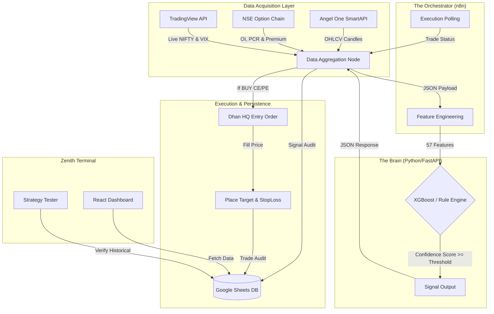

# 📘 ZENITH: The Complete Institutional Trading Manual
**Architecture, Algorithms, and Operational Guides for System v4.2.0**

> *“Eliminating emotional bias and execution latency through a data-driven, multi-indicator consensus engine.”*
> 
> **Version:** 4.2.0 (Proximus-1 / Zenith Core)
> **Author:** Antigravity AI Project Team
> **Last Updated:** March 2026

---

## 📖 Table of Contents

1. [Chapter 1: Strategic Vision & System Architecture](#chapter-1-strategic-vision--system-architecture)
2. [Chapter 2: The Intelligence Engine (Python & Machine Learning)](#chapter-2-the-intelligence-engine-python--machine-learning)
3. [Chapter 3: The Automation Matrix (n8n Workflow)](#chapter-3-the-automation-matrix-n8n-workflow)
4. [Chapter 4: Algorithmic Order Execution (Dhan HQ)](#chapter-4-algorithmic-order-execution-dhan-hq)
5. [Chapter 5: Data Persistence & Ledger (Google Sheets)](#chapter-5-data-persistence--ledger-google-sheets)
6. [Chapter 6: The Zenith Terminal (React Frontend)](#chapter-6-the-zenith-terminal-react-frontend)
7. [Chapter 7: Installation & Deployment Guide](#chapter-7-installation--deployment-guide)
8. [Chapter 8: Maintenance, Known Bugs, & Troubleshooting](#chapter-8-maintenance-known-bugs--troubleshooting)

---

## Chapter 1: Strategic Vision & System Architecture

### 1.1 The Proximus-1 / Zenith Evolution
Zenith (formerly Proximus-1) is a high-fidelity, automated intraday options trading framework designed specifically for the NIFTY 50 index. It bridges the gap between retail technical analysis and institutional-grade, nanosecond execution latency.

The system does not rely on a single crossover signal. Instead, it utilizes a **weighted consensus model**, drawing from 17 distinct technical indicators, institutional option chain data, and machine learning probabilities to calculate a highly accurate **Confidence Score**.

### 1.2 Core Pillars
The system operates on an "Integrated Intelligence" paradigm, ensuring a strict decoupling of concerns:

1. **The Brain (Python 3.12 / Machine Learning):** Analyzes the market, computes complex Option Greeks, and triggers XGBoost decision trees.
2. **The Nervous System (n8n):** Handles orchestration, fetching live ticks, packaging them for the Brain, and moving signals to the execution gateway.
3. **The View (React 18):** A professional, glassmorphism-styled command center offering real-time analytics and backtesting.

### 1.3 Architectural Flow

---

## Chapter 2: The Intelligence Engine (Python & Machine Learning)

### 2.1 The Transition to Python
Prior versions of this system (v2.x) calculated mathematical indicators directly inside n8n using JavaScript blocks. While functional, it hit processing limits when trying to accommodate heavy ML models and complex Black-Scholes calculations.

Version 4.0 moved all intellectual heavy lifting to a dedicated Python backend running **FastAPI**.

### 2.2 Feature Engineering (The 57 Features)
When n8n queries `localhost:8000/api/predict`, it passes raw OHLCV (Open, High, Low, Close, Volume) arrays. Python instantly computes exactly 57 distinct data points:
- **Core Indicators:** Wilder's Smoothed RSI, MACD Histogram, Average Directional Index (ADX), Bollinger Bands, SuperTrend.
- **Micro-Market Structure:** Detects Dojis, engulfing patterns, and Opening Range Breakouts (ORB).
- **The "Writers Zone":** Analyzes the Option Chain to locate "Max Pain" — the strike price where institutional option *sellers* (writers) lose the least money.

### 2.3 The XGBoost Prediction Model
The system uses an ensemble of decision trees (XGBoost). This AI doesn't just look for patterns; it looks for non-linear relationships. For example, it might learn that high RSI is only bearish if the India VIX is simultaneously dropping and the Put/Call Ratio is historically low.

If the AI confidence threshold is unmet, the system falls back to the heavily vetted **Rule Engine**.

### 2.4 The Rule Engine (Fallback & Guards)
The Rule Engine boasts adaptive risk management:
- **India VIX Squeeze:** If VIX is dangerously high (> 25), the market is in a panic state. The system immediately forces an **AVOID** signal to protect capital from erratic slippage.
- **ADX Penalty Ladder:** If the trend momentum (ADX) is low (< 10), it halves the overall confidence score, preventing the bot from bleeding capital in "choppy" sideways markets.

---

## Chapter 3: The Automation Matrix (n8n Workflow)

The n8n platform acts as the operational heartbeat.

### 3.1 The 5-Minute Tick Cycle
A CRON node triggers the sequence exactly every 5 minutes during trading hours (09:15 to 15:30 IST).
1. Is it a trading day?
2. Fetch Angel One SmartAPI data.
3. Parse Option Chain.
4. Ping Python API for the decision context.
5. Log to Google Sheets.
6. Evaluate Risk Filter and potentially execute on Dhan.

### 3.2 State Management and Memory
How does the bot know not to buy 15 times in a row during a massive bull run? 
Enter `$getWorkflowStaticData('global')`.

n8n maintains a persistent memory database across its 5-minute runs.
- **Streak Tracking:** It remembers the last signal. The bot requires a `MIN_STREAK = 2` (two consecutive BUY signals) to confirm a trend isn't just a 5-minute anomaly.
- **Repeat Protection:** Once it fires a "BUY CALL", it locks out additional CE entries until a cooling-off period ("Wait" bars) passes, preventing over-exposure.

### 3.3 Error Resilience
Financial APIs drop connections frequently. Almost all HTTP nodes in the n8n pipeline are set to **"Continue On Error"**. If Angel One fails to return a tick, the bot safely skips the 5-minute window rather than crashing the entire Node.js runtime process.

---

## Chapter 4: Algorithmic Order Execution (Dhan HQ)

Speed and accuracy at the execution layer define the difference between a profitable backtest and a blown live account.

### 4.1 Precision Targeting (Dynamic Symbology)
Options expire weekly. Hardcoding an instrument like "NIFTY 22500 CE" will break next week.

Zenith uses **Dynamic Symbology**.
When a `BUY CALL` signal fires, the n8n logic intercepts the live NSE Option Chain. It calculates the closest At-The-Money (ATM) strike based on the live Spot price, extracts the exact numeric `securityId` assigned by the exchange for that specific week, and passes *that* to the broker.

### 4.2 The Bracket Order Math
Orders are sent to Dhan HQ as **MARKET** orders for immediate fill.
Once the broker confirms the order is filled, it returns an `entryFillPrice`.

Within milliseconds, the bot fires two parallel orders:
1. **Stop Loss (SL-M):** `entryFillPrice - 12 points`
2. **Target (LIMIT):** `entryFillPrice + 25 points`

This enforces a strict mathematical Risk/Reward ratio of **1:2.08**. Max loss per lot is tightly capped at ₹900. Total emotional decoupling.

---

## Chapter 5: Data Persistence & Ledger (Google Sheets)

Zenith subverts traditional database architectures (Postgres/MySQL) in favor of Google Sheets. Why? 
**Immediate auditing from any mobile device, and zero-configuration frontend data fetching.**

### 5.1 The Ledger Schema
The spreadsheet is broken into three critical tables:

1. **Dhan_Signals (gid=0):** 
   Logs the exact state of the market every 5 minutes. Did the bot buy? Wait? Avoid? What was the RSI? What did the AI think? This is the ultimate white-box log.
2. **Dhan_Active_Trades:** 
   Only active trades populate here. Includes exact Order IDs from Dhan so the bot can cancel them if needed.
3. **Dhan_Trade_Summary:** 
   The graveyard of completed trades. Essential for calculating total PnL, Win Rates, and finding out exactly why a trade failed (Target Hit vs SL Hit).

### 5.2 Proxied Fetching
The React frontend does not use complex OAuth permissions. Because the Google Sheet is public (read-only), React downloads the raw CSV export directly from Google's servers. This provides a lightning-fast, CORS-friendly, zero-latency data pipeline.

---

## Chapter 6: The Zenith Terminal (React Frontend)

Housed in the `/src` folder, the Command Center is built on **React 18** and **Vite**.

### 6.1 The "Professional Midnight" Design
Retail trading apps look chaotic. Zenith’s UI is modeled after institutional terminals.
- **Background:** '#070b14' (Dark Space Navy)
- **Cards:** Heavy glassmorphism (frosted backgrounds).
- **Typography:** Inter for readability, JetBrains Mono for executing numbers.

### 6.2 Key Analytics Modules
- **KPI Grid:** Shows global PnL, current Win Rate, and the *Sharpe Efficiency Index*, giving an immediate health check of the algorithm.
- **Logic Trace Feed:** Decrypts the bot's decisions into English strings (e.g., *"MACD Bullish Flip | RSI Oversold | ADX Trending"*).
- **Execution Live Feed:** Pulses green or red as orders are placed or closed.

### 6.3 The Strategy Tester (Deterministic Backtesting)
This is the holy grail of Zenith. The Backtest page allows users to simulate "What if?"
If you change the Stop Loss to 15 points, how would the bot have performed over the last month?

It features **Real Match Verification**, meaning it doesn't just guess what happened; it cross-references its simulation with the actual historical trades made in the `Dhan_Trade_Summary` sheet to verify its exact real-world slippage.

---

## Chapter 7: Installation & Deployment Guide

Are you setting up Zenith on a new VPS or desktop? Follow these precise steps.

### Step 1: System Requirements
- Node.js version 18+
- Python 3.12+ (Tick "Add to PATH" during installation)
- Visual Studio Code

### Step 2: Booting the Intelligence Hub (Python)
1. Open terminal inside the project root.
2. Navigate to the API: `cd api/`
3. If on Windows, run the batch script: `start_server.bat`
   *(This creates a virtual environment, installs `xgboost`, `pandas`, `fastapi`, and boots the server on Port 8000).*
4. Verify the console says: `Application startup complete.`

### Step 3: Booting the Orchestrator (n8n)
1. Install n8n globally: `npm install -g n8n`
2. Start n8n: `n8n start`
3. Open a browser to `http://localhost:5678`.
4. Import the workflow: Go to Workflows -> Add -> Import from File. Select `project/n8n/workflows/NEWN8NFINAL.JSON`.
5. Populate the **Credentials Nodes** with your Dhan HQ API token and Angel One SmartAPI token.
6. Toggle the workflow to **Active**.

### Step 4: Booting the Zenith Terminal (React)
1. In a new terminal, ensure you are in the root `project/` directory.
2. Install dependencies: `npm install`
3. Boot the Vite server: `npm run dev`
4. Open your browser to `http://localhost:5173`. You will instantly see the Zenith Midnight dashboard.

---

## Chapter 8: Maintenance, Known Bugs, & Troubleshooting

### 1. The "LTP Zero" Error
**Symptom:** Signals are generated as `DATA_FAILURE` and the terminal shows LTP as ₹0.00.
**Cause:** The Angel One SmartAPI login JWT token has expired (it does this daily), or you are trying to pull market data outside of market hours/weekends.
**Fix:** The n8n workflow has an automated login node. Run it manually once to refresh the token, or wait for Monday at 09:15 AM.

### 2. Orders Failing (Status: REJECTED on Dhan)
**Symptom:** The bot fires a CE signal, but the order never reaches the Active Trades sheet.
**Cause:** 
- Insufficient margin in the Dhan account.
- The workflow's `SecurityId` is mismatched.
**Fix:** Ensure the Option Chain Request node is targeting `UnderlyingScrip: 13` (NIFTY). This guarantees it pulls the live ID for the *current* expiry week.

### 3. UI Charts are Blank or Missing
**Symptom:** The React dashboard shows loading states forever.
**Cause:** Google Sheets permissions are locked.
**Fix:** Open the Zenith Google Sheet. Click "Share" in the top right. Change from "Restricted" to "Anyone with the link can view". The UI will populate instantly.

### 4. Machine Learning Module Fails to Load
**Symptom:** Python server crashes mentioning `xgboost not found`.
**Fix:** Delete the `api/engine/venv` folder entirely. Double-click `start_server.bat` again to force a clean installation of all data-science packages.

---
*End of Document. Maintain security access and verify API connections daily.*
